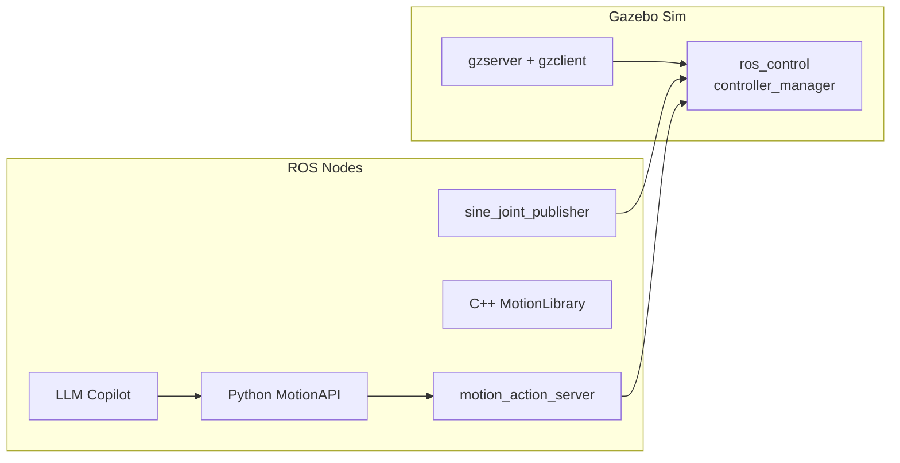

# UR5 Sim – ROS Noetic + Gazebo Classic

A reproducible, Docker‑first workspace for simulating, commanding and scripting a **Universal Robots UR5** arm using ROS 1 (Noetic), complete with:

* **Gazebo Classic** physics + ros\_control integration
* C++ **motion‑planning library** (joint trapezoids, Cartesian linear with IK)
* Thin **Python API** for reading robot state & calling motion primitives
* Optional **LLM Copilot** that converts natural‑language intents into UR5 API code

## ⚡ Quick start
<table>
<tr>

<td >

```bash
# 1. clone + build image
$ git clone https://github.com/ahmadabouelainein/ur5_sim.git
$ cd ur5_sim && docker compose build

# 2. open a new terminal in the running container
$ docker exec -it ur5_sim-dev bash
$ source /ws/devel/setup.bash

# 3. run a sine‑wave demo
$ roslaunch ur5_ros_gazebo ur5_sine_demo.launch
```

```bash
# python REPL inside the same container
$ python3 -m pip install ipython
$ ipython
In [1]: from ur_motion_api.motion_api import MotionAPI
In [2]: api = MotionAPI(); api.move_joint([], [0, -1.57, 1.57, 0, 0, 0])
```

</td>
</tr>
</table>

---

## 1 · Repository layout

```
ur5_sim/
├─ docker/ …                    # tooling
├─ Dockerfile  +  docker‑compose.yml
├─ ros_ws/                       # <‑‑ Catkin workspace root
│   └─ src/
│       ├─ universal_robot/ur_kinematics  # sparse‑cloned IK pkg
│       ├─ ur5_ros_gazebo/                # C++ sim + motion lib
│       └─ ur_motion_api/                 # Python API + LLM stub
└─ miscellaneous (README, LICENSE, bob.txt, scripts)

```


---

## 2 · Prerequisites

| Host requirement                      | Why                                                      |
| ------------------------------------- | -------------------------------------------------------- |
| **Docker ≥ 24**                       | Reproducible build & GPU off‑load                        |
| **VS Code Dev Containers** (optional) | Attach IDE to container for C++/Python LSP               |
| ≈ 10 GB free disk                     | image layers (ROS Noetic desktop‑full + Gazebo + models) |

*No host ROS installation needed.*

---

## 3 · Build & run (detailed)

1. **Clone**

   ```bash
   git clone https://github.com/ahmadabouelainein/ur5_sim.git && cd ur5_sim
   ```
2. **Build container** (multi‑stage; first stage compiles catkin workspace)

   ```bash
   docker compose build
   ```
3. **Spin up dev container** – attaches X‑forwarding & Gazebo GUI

   ```bash
   docker compose up -d
   docker exec -it ur5_sim-dev bash
   source /ws/devel/setup.bash
   ```
4. **Run bring‑up**

   ```bash
   roslaunch ur5_ros_gazebo ur5_gazebo.launch gui:=true
   ```
5. **Spawn controllers + sine node**

   ```bash
   roslaunch ur5_ros_gazebo ur5_sine_demo.launch
   ```

See `docs/run_manual.md` for CLI variants (headless, no‑GUI CI mode).

---

## 4 · Python API usage

```python
from ur_motion_api.motion_api import MotionAPI
import geometry_msgs.msg as gm

api = MotionAPI()

# moveJ: go directly to home pose
api.move_joint([], [0, -1.57, 1.57, 0, 0, 0])

# moveL: Cartesian 20 cm straight up
p0 = gm.Pose();  p1 = gm.Pose();  p1.position.z = 0.20
api.move_linear(p0, p1)
```

The API blocks until result by default; pass `wait=False` for asynchronous.

---

## 5 · Architecture



---

## 6 · Roadmap

* [x] **M1** – base UR5 sim + sine demo
* [x] **M2** – motion library & IK
* [x] **M3** – Python API wrapper
* [ ] **M4** – local LLM copilot (under development)
* [ ] CI pipeline (GitHub Actions) running headless simulation tests

---

## 7 · Troubleshooting

| Symptom                                     | Likely cause                                           | Fix                                                             |
| ------------------------------------------- | ------------------------------------------------------ | --------------------------------------------------------------- |
| Gazebo GUI crashes inside container         | Missing `--privileged` + X11 flags                     | use provided `docker compose up`                                |
| Action returns `success: False` immediately | first trajectory point not within controller tolerance | API now prepends auto‑segment; otherwise loosen YAML tolerances |
| `seed size (0) ??? DOFs (6)`                | Cartesian move called without IK seed                  | use `move_linear_using_current_state()` helper                  |

More Q\&A in [`docs/FAQ.md`](docs/FAQ.md).

---

## 8 · Credits & License

* **Universal Robots ROS‑Industrial** – URDF models & Gazebo integration (Apache 2.0)
* **llama.cpp / Ollama** – local LLM backend (MIT)

Project code © 2025 Ahmad Abouelainein – MIT License. 3rd‑party licenses remain with their respective authors.
